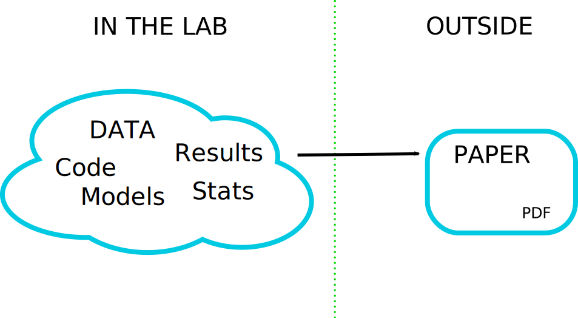

# Challenge

> ### _The problem is that most modern science is so complicated, and most journal articles so brief, it’s impossible for the article to include details of many important methods and decisions made by the researcher as he analyzed his data on his computer._

Ben Marwick: [How computers broke science – and what we can do to fix it](https://theconversation.com/how-computers-broke-science-and-what-we-can-do-to-fix-it-49938)

------

_"Claerbout's claim"_ in Donoho (2010), [An invitation to reproducible computational research](https://doi.org/10.1093/biostatistics/kxq028)

Claerbout & Karrenbach (1992), [Electronic documents give reproducible research a new meaning](https://doi.org/10.1190/1.1822162)


???

> [..] an article about a computational result is advertising, not scholarship. The actual scholarship is the full software environment, code and data, that produced the result." (Donoho, 2010)

**All stakeholders in science lack crucial skills, tools, and resources to enable publishing of the actual scholarship.**

### To illustrate the idea...


---
## Premise



We should be sharing material on the left, not the right; _"Paper as advert for Scholarship"_ [Buckheit & Donoho (1995)](https://link.springer.com/chapter/10.1007/978-1-4612-2544-7_5)

---

## Traditional and modern research(ers)

--

.pull-left[
**FROM**
<font style="font-size: 8em; font-weight: bolder;">T</font>
- broad knowledge: cross-discipline, collaboration
- deep knowledge: domain speciality (expertise and skills)
] 

--

.pull-right[
**TO**
<font style="font-size: 10em; font-weight: bolder; line-height: 0.8em">π</font>
- broad knowledge: cross-discipline, collaboration
- deep knowledge
  - domain speciality (expertise and skills)
  - **stats/computing/reproducibility**
]

--

<div style="position: absolute; z-index: 1; left: 25%; top:20%"></div>

--

<div style="position: absolute; z-index: 1; left: 75%; top:20%"></div>

------

Sources: [T-shaped skills](https://en.wikipedia.org/wiki/T-shaped_skills); [Hacking Academia: Data Science and the University](https://jakevdp.github.io/blog/2014/08/22/hacking-academia/); 
[When All Science Becomes Data Science](https://www.sciencemag.org/careers/2013/05/when-all-science-becomes-data-science); [Community-level data science](https://escience.washington.edu/community-level-data-science-and-its-spheres-of-influence-beyond-novelty-squared/)
Public domain images: [Wikipedia, CDC](https://en.wikipedia.org/wiki/Biosafety_cabinet#/media/File:Influenza_virus_research.jpg), [Wikipedia, kallerma](https://commons.wikimedia.org/wiki/File:Computer_case.JPG)

???

### This applies to both authors and reviewers!

**Tradition: wet lab, lab coats, safety glasses...**

**Modern: what are the gloves and safety procedures for our digital laboratories?**

**There is no reproducibility crisis, just a realisation that we need to adjust - an _opportunity!**

------

Wikipedia:
> The concept of T-shaped skills, or T-shaped persons is a metaphor used in job recruitment to describe the abilities of persons in the workforce. The vertical bar on the letter T represents the depth of related skills and expertise in a single field, whereas the horizontal bar is the ability to collaborate across disciplines with experts in other areas and to apply knowledge in areas of expertise other than one's own. 

- From T-shaped researcher to PI-shaped resarchers
- All science becomes data science

------

- DORA (declaration on researcher assessment)
- Open Science
  - Reproducible Research / Open Methods
  - p-hacking
  - preregistered reports
- Data citation
- Software citation
- Non-paper outputs in academia


---
## Approaches to code sharing

.pull-left[

]

--

.pull-right[
- Informal 'code buddy' system

- Community-led *research compendia*

- Online workspaces/infrastructure (e.g., [Code Ocean Nature trial](https://link.springer.com/chapter/10.1007/978-1-4612-2544-7_5), see also [Konkol et al., 2020](https://doi.org/10.1186/s41073-020-00095-y), for a review)

- Certify reproducibility with confidential data (CASCAD) ([Pérignon et al., 2019](http://doi.org/10.1126/science.aaw2825))
]

???

We're not the first to think about this!

### CODECHECK takes a different approach . . .

---
class: center, middle

```{r setup, include=FALSE}
options(htmltools.dir.version = FALSE)
```


## _Independent execution of computations underlying research articles._

???

Four principles to give the intention and spirit.
_No certification of someone doing a CODECHECK,_ everything is open.

---
class: center, inverse

# The four CODECHECK principles

### 1. Codecheckers record but don’t investigate or fix.

--

### 2. Communication between humans is key.

--

### 3. Credit is given to codecheckers.

--

### 4. Workflows must be auditable.

--

### &nbsp;


???

**In a nutshell**: at one point in time, a codechecker puts their name under a report that describes what they did and what they achieved. Not "one click", no mandatory containers, no open source requirement, no cool infrastructure (and believe me I love cool computing infrastructures).

### Research Compendia make this a lot less complicated!

-----

1. A codechecker is _not_ required to fix workflows, but to document the given state of documentation and executability. Of course, given a level of interested and skills, a codechecker may go beyond simple small fixes and actively collaborate with an author to create a better research output. The codechecker's report provides helpful input to the scientific review, e.g., to help the reviewer's understanding. But a CODECHECK does not evaluate scientific merit! A failed CODECHECK does not imply the rejection of a submission.
  - _Not_ fixing, but _document_ state
  - Interest + skills = collaboration & improvement
  - **Report** informs the scientific review, but not evaluate scientific merit!
  - Failed check != rejection
  - **Codechecker take the pictures at a crime scene, they do not hunt the murderer.**
2. The priority in all documentation and metadata is that a human codechecker can understand them. The codechecker is _not_ making a scientific judgement. It is also close to impossible to make a CODECHECK blind. Therefore a CODECHECK must not be anonymised must provide a two-way means of communication between author and codechecker. Codecheckers are supported by formal metadata, automation, and reproducibility infrastructure, yet the CODECHECK shall not rely on them. Codechecks may be conducted by existing stakeholders in the submission process (e.g., a reviewer), but may also be handled with new roles and by people underrepresented in classic peer-review, such as early career researchers (ECRs) or research software engineers (RSEs).
3. Common sense and a collaborative process are the main drivers behind the level of documentation, the degree of openness, and the amount of data that is checked. But the minimal requirement is that the codechecker has enough material to validate the workflow submitted by the authors. This means the code could be executed once by following the provided instructions and selected outputs, e.g. figures or data files, are created. Ideally, the execution is fully scripted, and the execution can be triggered by a running a single command. Being executed once means that a detailed investigation may occur at a later time. Being auditable includes that authors provide data and code for relevant analysis steps and visualisations to the codecheckers, but does not imply that all of the code associated with an article must be checked. The CODECHECK is not automated on purpose: automation may lead to people gaming the system, and may hide details that eventually decrease level of certainty that a codechecker has in their assessment.
  - Software is **crucial** for research
  - Check is **contribution** to the scientific body of knowledge
  - If part of a review process
    - **publisher** ensures creditation equal to scientific reviewer
    - methods section _statement_
    - deposited metadata (not report):
        - codechecker's ORCID
        - time, journal
        - (article DOI)
  - **DOI**-able report, URL in _statement_
4. Common sense and a collaborative process are the main drivers behind the level of documentation, the degree of openness, and the amount of data that is checked. But the minimal requirement is that the codechecker has enough material to validate the workflow submitted by the authors. This means the code could be executed once by following the provided instructions and selected outputs, e.g. figures or data files, are created. Ideally, the execution is fully scripted, and the execution can be triggered by a running a single command. Being executed once means that a detailed investigation may occur at a later time. Being auditable includes that authors provide data and code for relevant analysis steps and visualisations to the codecheckers, but does not imply that all of the code associated with an article must be checked. The CODECHECK is not automated on purpose: automation may lead to people gaming the system, and may hide details that eventually decrease level of certainty that a codechecker has in their assessment. 
  - **Common sense**
    - documentation
    - degree of openness
    - amount of data
  - Minimal requirement
    - **Code executed once**
    - **Scripted workflow**
  - "Everything is there" _for the checked data & code_, and auditable
  - Not all steps must be checked

---
# The CODECHECK philosophy

- Systems like Code Ocean set the bar high by "making code   reproducible *forever* for *everyone*".

- CODECHECK  simply asks "was the code reproducible *once* for *someone* else?"

- We check the code runs and generates the expected number of output files.

- The contents of those output files are not necessarily checked, but are available for others to see.
  
- The validity of the code is *not* checked.

---
## Implementing the CODECHECK process


_Sketch of steps and responsibilities to implement a CODECHECK_, see **https://codecheck.org.uk/process/**.

???

Role of publisher: controls process, and realises that credit is given

---
### Process variations


--

- Post review with extra role (ECR opportunity)
- Pre-review with extra role on staff
- Parallel reproducibility reviewer (flexible skill matching)
- Regular reviewer (though not widely established during last 20 years ¯\\\_(ツ)_/¯ )
- Independent community checks for preprints or postprints

https://codecheck.org.uk/process/

???

Four dimensions:

- Who does the review?
- When does it happen?
- How transparent is it?
- How fast does it need to be?

**Are you involved in any journal or conference where this is, or could be, applied?**

### Post review with extra role

1. A manuscript with computations passes scientific peer-review and is assigned a codechecker with matching expertise (first priority: code, second priority: domain).
1. The codechecker must understand the instructions and executes the workflow using the CODECHECK infrastructure.
   They contact the manuscript author if needed and collaborate based on the CODECHECK infrastructure.
1. A CODECHECK evaluates if the code and data produce a core output (figure, dataset) - it is _not_ a result check or judgement of scientific merit.
1. The codechecker makes the final call on the result within a week, publishes the checked code and data together with the environment in a public repository (with DOI), and puts their name on it. A  badge on the published article points to the repository with the checked files.

### Pre-review with extra role on staff

1. An editorial staff member/ECR with technical expertise checks if something is "mechanically wrong" before sending out a submission to review.
   This is worth the time together with other technical checks! The codechecker can reach out to the author to fix problems.
   It is also a sanity check for the author and a measure of seriousness for the journal.
1. If a CODECHECK is successful, start the regular review.
1. After acceptance, add  badge to the published article.

### Parallel reproducibility reviewer

1. A manuscript is submitted to a journal or conference.
1. It is assigned a scientific reviewer with the suitable domain expertise, and a codechecker with matching technical expertise.
   The scientific review is conducted open/single-blind/double-blind, while the codechecker knows the author and can reach out directly through the best channel, e.g. email, GitHub/GitLab issues, or discussion forums.
1. Both reviewer and codechecker follow the same deadline.
1. Both the scientific review and the CODECHECK result are submitted to the handling editor or programme committee member, who makes the decision on how to proceed.
1. Independent of the submissions acceptance, the CODECHECK findings are sent to the submitting author.

### Regular reviewer

The review process is conducted as usual, but the editor does not only match the domain expertise but also technical skills.
The reviewer conducts the CODECHECK and submits the resulting certificate as part of his report.
This variant requires an open peer review and a broad pool of reviewers.

### Independent community pre-review

An author may also reach out to a colleague or find a [Code Copilot](https://twitter.com/Code_Copilot) on Twitter, who can give feedback but also create a CODECHECK report according the a journal's/conference's implementation of the principles.
This report certainly increases trust in a workflow and may help authors to include code and data in their submission.
Such an independent report may even be taken up during review and take the place of a report usually created by a different process described on this page.

### More?

You have ideas about how a CODECHECK would work for your journal or conference? _Let us know !_

???

In our discussions with editors and publishers, we found that the _point in time_ during the review process when a CODECHECK happens, the person who takes the role of codechecker, and the openness of the codechek, can vary.
For example, the check may happen before peer review or after, the codechecker can be staff, a regular reviewer, or a member of a special reproducibility committee, the check may be open or blind, either matching or differing from the scientific review, and the results may be published or confidential.

---

[](https://codecheck.org.uk/register/)

**https://codecheck.org.uk/register/**

---
# Example 1 (Stephen)

.pull-left[

[](https://doi.org/10.5281/zenodo.3865491)

#### https://zenodo.org/record/3865491/files/codecheck.pdf

_ "It ain't pretty, but it works"_
(Hilda Bastian)

------

(Tweet on the right: https://twitter.com/SabineLvE/status/1270789727059349505)
]

.pull-right[
<blockquote class="twitter-tweet"><p lang="en" dir="ltr">Independent review <a href="https://twitter.com/StephenEglen?ref_src=twsrc%5Etfw">@StephenEglen</a> confirmed that <a href="https://twitter.com/MRC_Outbreak?ref_src=twsrc%5Etfw">@MRC_Outbreak</a> team&#39;s <a href="https://twitter.com/hashtag/COVID19?src=hash&amp;ref_src=twsrc%5Etfw">#COVID19</a> simulation is reproducible: thumbs up from code-checking efforts <a href="https://twitter.com/nature?ref_src=twsrc%5Etfw">@nature</a> <a href="https://twitter.com/hashtag/COVID19?src=hash&amp;ref_src=twsrc%5Etfw">#COVID19</a> <a href="https://twitter.com/hashtag/covid19science?src=hash&amp;ref_src=twsrc%5Etfw">#covid19science</a><a href="https://t.co/vpa7CkPZjV">https://t.co/vpa7CkPZjV</a></p>&mdash; Sabine L.van Elsland (@SabineLvE) <a href="https://twitter.com/SabineLvE/status/1270789727059349505?ref_src=twsrc%5Etfw">June 10, 2020</a></blockquote>
<script async src="https://platform.twitter.com/widgets.js" charset="utf-8"></script>
]

---
# Example 2 (Daniel)

.pull-left[

[](https://doi.org/10.5281/zenodo.3981253)

Report: **https://zenodo.org/record/3981253/files/codecheck.pdf**

Repository: https://github.com/codecheckers/OpeningPractice
]

.pull-right[

]

---

.pull-left[

]

.pull-right[

]

https://zenodo.org/record/3981253/files/codecheck.pdf

---
# What would help to conduct CODECHECKs?

### 1. Good **README** files

--

### 2. Advanced control of **computing environments**

--

### 3. Good practices around **research compendia**

--

### 4. Suggest and reward little steps

--

### 5. Tools for codecheckers

--

https://codecheck.org.uk/guide/community-process

---

## Every little step helps

.pull-left[
### Concrete steps for authors

- have a `README` ([_"all else is details"_](http://teachtogether.tech/))
- "document for future you"
- use [good file names](http://www2.stat.duke.edu/~rcs46/lectures_2015/01-markdown-git/slides/naming-slides/naming-slides.pdf) and paths
- use text-based, open file formats
- publish data subsets/mock data
- apply templates & follow community good practices (e.g., `rrtools`)
- write and publish notebooks
- use only scripts, no point-and-click
- embrace openness & [be](https://doi.org/10.1186/s13059-015-0850-7)-[ne](https://doi.org/10.1093/biostatistics/kxq028) [fi](https://doi.org/10.1109/MSP.2009.932122)-[ts](https://doi.org/10.1007/s10816-015-9272-9)
- work/review in the spirit of [**preproducibility**](https://doi.org/10.1038/d41586-018-05256-0)
- only work in containers
------
**= USE RESEARCH COMPENDIA**
]

--

.pull-right[
### Sustainable culture change

- every step towards openness and reproducibility matters (spectrum!)
- acknowledge challenges of computational reproducibility in education and publications
- reward early adopters
- _change policies_
]

???

Rule 1 inspired by Greg Wilson's Teach Together.

**working openly and reproducibliy can be scary**

------

- clear benefits!
- transparency = effectivity
- open science = science
- reproducible research = research

---
# Next steps

.pull-left[

### 1. Embedding into journal workflows

### 2. Training a community of codecheckers

### 3. Funding for a codecheck editor

]

--

.pull-right[
_CODECHECK is an open community:_

### Get involved as a...

- codechecker
- author
- reviewer
- editor
- publisher
- conference organiser

**https://codecheck.org.uk/get-involved/**

]

---
### More information: [codecheck.org.uk](https://codecheck.org.uk/)

.pull-left[
#### Team

- <a href="https://twitter.com/StephenEglen"><svg viewBox="0 0 16 16" width="16px" height="16px" xmlns="http://www.w3.org/2000/svg"> <title>Twitter</title> <path fill="#828282" d="M15.969,3.058c-0.586,0.26-1.217,0.436-1.878,0.515c0.675-0.405,1.194-1.045,1.438-1.809c-0.632,0.375-1.332,0.647-2.076,0.793c-0.596-0.636-1.446-1.033-2.387-1.033c-1.806,0-3.27,1.464-3.27,3.27 c0,0.256,0.029,0.506,0.085,0.745C5.163,5.404,2.753,4.102,1.14,2.124C0.859,2.607,0.698,3.168,0.698,3.767 c0,1.134,0.577,2.135,1.455,2.722C1.616,6.472,1.112,6.325,0.671,6.08c0,0.014,0,0.027,0,0.041c0,1.584,1.127,2.906,2.623,3.206 C3.02,9.402,2.731,9.442,2.433,9.442c-0.211,0-0.416-0.021-0.615-0.059c0.416,1.299,1.624,2.245,3.055,2.271 c-1.119,0.877-2.529,1.4-4.061,1.4c-0.264,0-0.524-0.015-0.78-0.046c1.447,0.928,3.166,1.469,5.013,1.469 c6.015,0,9.304-4.983,9.304-9.304c0-0.142-0.003-0.283-0.009-0.423C14.976,4.29,15.531,3.714,15.969,3.058z"></path> </svg></span> StephenEglen</a>
- <a href="https://twitter.com/nordholmen"><svg viewBox="0 0 16 16" width="16px" height="16px" xmlns="http://www.w3.org/2000/svg"> <title>Twitter</title> <path fill="#828282" d="M15.969,3.058c-0.586,0.26-1.217,0.436-1.878,0.515c0.675-0.405,1.194-1.045,1.438-1.809c-0.632,0.375-1.332,0.647-2.076,0.793c-0.596-0.636-1.446-1.033-2.387-1.033c-1.806,0-3.27,1.464-3.27,3.27 c0,0.256,0.029,0.506,0.085,0.745C5.163,5.404,2.753,4.102,1.14,2.124C0.859,2.607,0.698,3.168,0.698,3.767 c0,1.134,0.577,2.135,1.455,2.722C1.616,6.472,1.112,6.325,0.671,6.08c0,0.014,0,0.027,0,0.041c0,1.584,1.127,2.906,2.623,3.206 C3.02,9.402,2.731,9.442,2.433,9.442c-0.211,0-0.416-0.021-0.615-0.059c0.416,1.299,1.624,2.245,3.055,2.271 c-1.119,0.877-2.529,1.4-4.061,1.4c-0.264,0-0.524-0.015-0.78-0.046c1.447,0.928,3.166,1.469,5.013,1.469 c6.015,0,9.304-4.983,9.304-9.304c0-0.142-0.003-0.283-0.009-0.423C14.976,4.29,15.531,3.714,15.969,3.058z"></path> </svg></span> nordholmen</a>
- <a href="mailto:sje30@cam.ac.uk"><svg xmlns:dc="http://purl.org/dc/elements/1.1/" xmlns:cc="http://creativecommons.org/ns#" xmlns:rdf="http://www.w3.org/1999/02/22-rdf-syntax-ns#" xmlns:svg="http://www.w3.org/2000/svg" xmlns="http://www.w3.org/2000/svg" xmlns:sodipodi="http://sodipodi.sourceforge.net/DTD/sodipodi-0.dtd" xmlns:inkscape="http://www.inkscape.org/namespaces/inkscape" version="1.1" id="Capa_1" x="0px" y="0px" width="16" height="16" viewBox="0 0 16 16" xml:space="preserve" sodipodi:docname="icon-email.svg" inkscape:version="0.92.4 (5da689c313, 2019-01-14)"><metadata id="metadata51"><rdf:rdf><cc:work rdf:about=""><dc:format>image/svg+xml</dc:format><dc:type rdf:resource="http://purl.org/dc/dcmitype/StillImage"></dc:type><dc:title></dc:title></cc:work></rdf:rdf></metadata><defs id="defs49"></defs><sodipodi:namedview pagecolor="#ffffff" bordercolor="#666666" borderopacity="1" objecttolerance="10" gridtolerance="10" guidetolerance="10" inkscape:pageopacity="0" inkscape:pageshadow="2" inkscape:window-width="1271" inkscape:window-height="760" id="namedview47" showgrid="false" inkscape:zoom="25.632621" inkscape:cx="7.4068351" inkscape:cy="6.1984896" inkscape:window-x="2444" inkscape:window-y="671" inkscape:window-maximized="0" inkscape:current-layer="g12" units="px"></sodipodi:namedview> <g id="g14" transform="translate(0,-48)"> <g id="g12"> <g id="mail" transform="matrix(0.48484849,0,0,0.48484849,3.4538886,19.654753)"> <g id="g9" style="stroke:#828282;stroke-opacity:1" transform="translate(2.1709556,1.8281712)"> <path d="M 21.205399,62.1339 H -6.7946007 c -1.104,0 -2,0.896 -2,2 v 18 c 0,1.104 0.896,2 2,2 H 21.205399 c 1.104,0 2,-0.896 2,-2 v -18 c 0,-1.104 -0.896,-2 -2,-2 z m -1.795,2 -12.2049997,12 -12.109,-12 z m -26.2049997,18 v -16.994 l 9.589,9.589 -7.528,7.405 z m 4.985,0 6.081,-5.927 1.58,1.579 c 0.781,0.781 2.047,0.781 2.829,0 l 1.5309997,-1.531 6.081,5.879 z m 23.0149997,0 h -1.939 l -7.527,-7.405 9.466,-9.467 z" id="path7" style="fill:#828282;stroke:#828282;stroke-opacity:1" inkscape:connector-curvature="0"></path> </g> </g> </g> </g> <g id="g16" transform="translate(0,-48)"> </g> <g id="g18" transform="translate(0,-48)"> </g> <g id="g20" transform="translate(0,-48)"> </g> <g id="g22" transform="translate(0,-48)"> </g> <g id="g24" transform="translate(0,-48)"> </g> <g id="g26" transform="translate(0,-48)"> </g> <g id="g28" transform="translate(0,-48)"> </g> <g id="g30" transform="translate(0,-48)"> </g> <g id="g32" transform="translate(0,-48)"> </g> <g id="g34" transform="translate(0,-48)"> </g> <g id="g36" transform="translate(0,-48)"> </g> <g id="g38" transform="translate(0,-48)"> </g> <g id="g40" transform="translate(0,-48)"> </g> <g id="g42" transform="translate(0,-48)"> </g> <g id="g44" transform="translate(0,-48)"> </g> </svg></span> Stephen Eglen</a>, [University of Cambridge](https://www.cam.ac.uk/)
- <a href="mailto:daniel.nuest@uni-muenster.de"><svg xmlns:dc="http://purl.org/dc/elements/1.1/" xmlns:cc="http://creativecommons.org/ns#" xmlns:rdf="http://www.w3.org/1999/02/22-rdf-syntax-ns#" xmlns:svg="http://www.w3.org/2000/svg" xmlns="http://www.w3.org/2000/svg" xmlns:sodipodi="http://sodipodi.sourceforge.net/DTD/sodipodi-0.dtd" xmlns:inkscape="http://www.inkscape.org/namespaces/inkscape" version="1.1" id="Capa_1" x="0px" y="0px" width="16" height="16" viewBox="0 0 16 16" xml:space="preserve" sodipodi:docname="icon-email.svg" inkscape:version="0.92.4 (5da689c313, 2019-01-14)"><metadata id="metadata51"><rdf:rdf><cc:work rdf:about=""><dc:format>image/svg+xml</dc:format><dc:type rdf:resource="http://purl.org/dc/dcmitype/StillImage"></dc:type><dc:title></dc:title></cc:work></rdf:rdf></metadata><defs id="defs49"></defs><sodipodi:namedview pagecolor="#ffffff" bordercolor="#666666" borderopacity="1" objecttolerance="10" gridtolerance="10" guidetolerance="10" inkscape:pageopacity="0" inkscape:pageshadow="2" inkscape:window-width="1271" inkscape:window-height="760" id="namedview47" showgrid="false" inkscape:zoom="25.632621" inkscape:cx="7.4068351" inkscape:cy="6.1984896" inkscape:window-x="2444" inkscape:window-y="671" inkscape:window-maximized="0" inkscape:current-layer="g12" units="px"></sodipodi:namedview> <g id="g14" transform="translate(0,-48)"> <g id="g12"> <g id="mail" transform="matrix(0.48484849,0,0,0.48484849,3.4538886,19.654753)"> <g id="g9" style="stroke:#828282;stroke-opacity:1" transform="translate(2.1709556,1.8281712)"> <path d="M 21.205399,62.1339 H -6.7946007 c -1.104,0 -2,0.896 -2,2 v 18 c 0,1.104 0.896,2 2,2 H 21.205399 c 1.104,0 2,-0.896 2,-2 v -18 c 0,-1.104 -0.896,-2 -2,-2 z m -1.795,2 -12.2049997,12 -12.109,-12 z m -26.2049997,18 v -16.994 l 9.589,9.589 -7.528,7.405 z m 4.985,0 6.081,-5.927 1.58,1.579 c 0.781,0.781 2.047,0.781 2.829,0 l 1.5309997,-1.531 6.081,5.879 z m 23.0149997,0 h -1.939 l -7.527,-7.405 9.466,-9.467 z" id="path7" style="fill:#828282;stroke:#828282;stroke-opacity:1" inkscape:connector-curvature="0"></path> </g> </g> </g> </g> <g id="g16" transform="translate(0,-48)"> </g> <g id="g18" transform="translate(0,-48)"> </g> <g id="g20" transform="translate(0,-48)"> </g> <g id="g22" transform="translate(0,-48)"> </g> <g id="g24" transform="translate(0,-48)"> </g> <g id="g26" transform="translate(0,-48)"> </g> <g id="g28" transform="translate(0,-48)"> </g> <g id="g30" transform="translate(0,-48)"> </g> <g id="g32" transform="translate(0,-48)"> </g> <g id="g34" transform="translate(0,-48)"> </g> <g id="g36" transform="translate(0,-48)"> </g> <g id="g38" transform="translate(0,-48)"> </g> <g id="g40" transform="translate(0,-48)"> </g> <g id="g42" transform="translate(0,-48)"> </g> <g id="g44" transform="translate(0,-48)"> </g> </svg></span> Daniel Nüst</a>, [University of Münster](https://www.uni-muenster.de/)

#### Acknowledgements

The project is supported by a Mozilla Open Science Mini-Grant (see [official announcement](https://medium.com/read-write-participate/meet-mozillas-latest-open-science-awardees-cfa45348e5d5)) from February 2019 to May 2020.

[](https://foundation.mozilla.org)

Supported by the UK Software Sustainability Institute.

Editors @ Gigascience, eLife, Scientific Data.

]

.pull-right[

#### Material

Everything is on GitHub <a href="https://github.com/codecheckers/"><svg viewBox="0 0 16 16" width="16px" height="16px" xmlns="http://www.w3.org/2000/svg"><title>GitHub</title> <path fill="currentColor" d="M7.999,0.431c-4.285,0-7.76,3.474-7.76,7.761 c0,3.428,2.223,6.337,5.307,7.363c0.388,0.071,0.53-0.168,0.53-0.374c0-0.184-0.007-0.672-0.01-1.32 c-2.159,0.469-2.614-1.04-2.614-1.04c-0.353-0.896-0.862-1.135-0.862-1.135c-0.705-0.481,0.053-0.472,0.053-0.472 c0.779,0.055,1.189,0.8,1.189,0.8c0.692,1.186,1.816,0.843,2.258,0.645c0.071-0.502,0.271-0.843,0.493-1.037 C4.86,11.425,3.049,10.76,3.049,7.786c0-0.847,0.302-1.54,0.799-2.082C3.768,5.507,3.501,4.718,3.924,3.65 c0,0,0.652-0.209,2.134,0.796C6.677,4.273,7.34,4.187,8,4.184c0.659,0.003,1.323,0.089,1.943,0.261 c1.482-1.004,2.132-0.796,2.132-0.796c0.423,1.068,0.157,1.857,0.077,2.054c0.497,0.542,0.798,1.235,0.798,2.082 c0,2.981-1.814,3.637-3.543,3.829c0.279,0.24,0.527,0.713,0.527,1.437c0,1.037-0.01,1.874-0.01,2.129 c0,0.208,0.14,0.449,0.534,0.373c3.081-1.028,5.302-3.935,5.302-7.362C15.76,3.906,12.285,0.431,7.999,0.431z"></path> </svg></span> https://github.com/codecheckers/</span></a>.

Watch Stephen's talks on CODECHECK at [The 14th Munin Conference on Scholarly Publishing 2019](https://mediasite.uit.no/Mediasite/Play/8027873496dc465ebc4b9b3ab0338ad01d?playFrom=1772000) and at the [UK Open Research Working Group meeting in September 2020](https://www.youtube.com/watch?v=sAzvz-ZZYuU).

#### Declarations

SJE is affiliate editor of bioRxiv and senior editor of Scientific Data.

]

???

---
class: blackout

---
## Advanced control of computing environments

- [Binder-ready](https://mybinder.org/) research compendium 

- Research compendium + container + bindings =<br/> [Executable Research Compendium](https://doi.org/10.1045/january2017-nuest) ([o2r.info/results/](https://o2r.info/results/))
<div style="position: absolute; left: 75%; top:25%"><a href="https://doi.org/10.1045/january2017-nuest"></a></div>

- [Ten Simple Rules for Writing Dockerfiles for Reproducible Data Science](https://doi.org/10.31219/osf.io/fsd7t)

---
class: inverse, center

## Research Compendium


### [research-compendium.science](https://research-compendium.science/)

---

## Research compendia

> ### ...We introduce the concept of a _compendium as_ both _a container for_ the different elements that make up the document and its computations (i.e. _text, code, data, ..._), and as a means for _distributing_, _managing_ and _updating_ the collection.

Gentleman, Robert, and Duncan Temple Lang. 2007. "Statistical Analyses and Reproducible Research". Journal of Computational and Graphical Statistics 16 (1): 1–23. https://doi.org/10.1198/106186007X178663

???

- R package
- Python package
- text
  - pape
  - README
  - **notebook** + literate programming
- code
  - scripts
  - dependencies
  - computing environment
  - **virtual laboratoy**
- data
  - YMMV

_but there are small extra bits and pieces that make a research compendium really useful_

---
class: center


Source: Ram (2019), [How To Make Your Data Analysis Notebooks More Reproducible](https://github.com/karthik/rstudio2019)

???

**Research compendia are also a style of doing research!**

- License (not usable without one)
- VCS (good practice)
- Metadata (contribution, citation)
- Archive (!= GitHub)

---
## Research compendia

#### Ram (2019), [How To Make Your Data Analysis Notebooks More Reproducible](https://github.com/karthik/rstudio2019)

- small, medium, large compendia

--

- Stick with the conventions of your peers
- Keep data, methods and outputs separate
- Specify your computational environment as clearly as you can

--

- Leverage the R package structure and support tools/services as much as possible
- Use modern tools to make your compendia more accessible ([repo2docker](https://github.com/jupyter/repo2docker/), [containerit](https://o2r.info/containerit/), [holepunch](https://github.com/karthik/holepunch), [drake](https://docs.ropensci.org/drake/))
- Don't forget long-term archives and simpler formats ([Zenodo](https://zenodo.org/))

???

**YMMV**

- "conscious" project creation

**key principles**

  - conventions > "reader perspective" (How to Read...)

**take home messages**

  - R Markdown is really powerful, multi-language > have one control script
  - don't obsess about "once click reproduce", but from time to time that should work!

---
class: center


Source: Ram (2019), [How To Make Your Data Analysis Notebooks More Reproducible](https://github.com/karthik/rstudio2019)

???

------

**Why is the little ikea man so happy?**

---
class: inverse, center, middle

.pull-left[

]

--

.pull-right[
# Transparent

# Credit

# Discover

# Reuse

# Colaborate
]

---
class: center, inverse, middle

# More on research compendia at [research-compendium.science](https://research-compendium.science/)

------

**You want to introduce changes in your community?**

### [_Reproducible Publications at AGILE Conferences_](https://osf.io/phmce/)

[AGILE Reproducible Paper Guidelines](https://doi.org/10.17605/OSF.IO/CB7Z8)

https://reproducible-agile.github.io/

???

In my opinion, only carrots do not cut it, so we need sticks:

- author guidelines
- don't cite work that is not reproducible
- don't review work that is not reproducible

---
class: inverse

# ERCs in peer review


.pull-left[

### https://o2r.info/pilots/

- Collaboration pilots

- OJS pilot

]

---
# o2r goals and benefits


https://o2r.info/results | https://o2r.uni-muenster.de/

---
# o2r goals and benefits


Nüst, Daniel, Markus Konkol, Edzer Pebesma, Christian Kray, Marc Schutzeichel, Holger Przibytzin, and Jörg Lorenz. 2017. Opening the Publication Process with Executable Research Compendia. D-Lib Magazine 23 (1/2). https://doi.org/10.1045/january2017-nuest.

Kray, Christian, Pebesma, Edzer, Konkol, Markus, Nüst, Daniel (2019). Reproducible Research in Geoinformatics: Concepts, Challenges and Benefits. https://doi.org/10.4230/LIPIcs.COSIT.2019.8

------

### THANK YOU!

Slides:

- [](https://doi.org/10.5281/zenodo.3855440)
- [PDF](https://codecheck.org.uk/slides/2020-05_ReproHack.pdf)
- **https://github.com/codecheckers/slides**

???

- * inspired by Greg Wilson's Teach Tech Together
- Publishing computational research -- A review of infrastructures for reproducible and transparent scholarly communication by Markus Konkol, Daniel Nüst, Laura Goulier
- "start early": in your career, in each project

------

Next steps and current status:

- creating first certificates
- coordinating with publishers (eLife, GigaScience) on prototypes
- writing a paper about principles and variations

**THANK YOU**

---
## Computational Research / Data Science 2020

.pull-left[
### Challenges

- dependency hell
- FAIR
- licensing
- sensitive data
- big data

]

.pull-right[
### Opportunities/Solutions

- version control
- containerisation
- openness (data, software, preprints)
- community
- self-education
- collaboration
- research integrity
- [The Carpentries](https://carpentries.org/)
- subsets/[enclaves](https://doi.org/10.1177/0002716217742610)/[domains](https://doi.org/10.1177/2399808317710132)
]

???

```{r copy_slides_to_docs, include=FALSE}
file.copy(from = "slides.html",
          to = file.path("../docs", paste0(basename(getwd()), ".html")),
          overwrite = TRUE)
# copy images manually once
```

```{r create_pdf, eval=FALSE, include=FALSE}
current_file <- basename(rstudioapi::getSourceEditorContext()$path)
system(paste0("cat ", current_file, " | grep -v '^--$' > print.Rmd"))
rmarkdown::render("print.Rmd", "xaringan::moon_reader")
xaringan::decktape(file = "print.html", output = "slides.pdf", docker = TRUE)
file.copy(from = "slides.pdf",
          to = file.path("../docs", paste0(basename(getwd()), ".pdf")),
          overwrite = TRUE)
file.remove("slides.pdf", "print.html", "print.Rmd")
```
