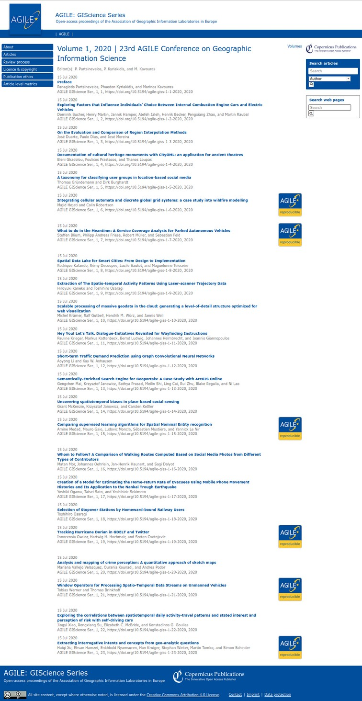

## Agenda

HTML slides: <https://bit.ly/cw22-keynote-daniel>

PDF slides: <https://doi.org/10.6084/m9.figshare.19487573>

--

.pull-left[

]

--

.pull-right[


<https://reproducible-agile.github.io>
]

---
# Declarations and acknowledgements

## Declarations

Reproducibility Chair AGILE conference

CODECHECK paper: <https://f1000research.com/articles/10-253/v2>

## Acknowledgements

**CODECHECK**: Mozilla mini science grant, UK SSI; editors @ *Gigascience*, *eLife*, *Scientific Data*

**Reproducible AGILE** received funding as an [AGILE Initiative](https://agile-online.org/index.php/agile-actions/current-initiatives/reproducible-publications-at-agile-conferences)

All work was supported by the project Opening Reproducible Research ([o2r](https://o2r.info)) with funding by the German Research Foundation (Deutsche Forschungsgemeinschaft, DFG) under project numbers PE&nbsp;1632/10-1 and PE&nbsp;1632/17-1.

.pull-left[
[](https://www.uni-muenster.de/Geoinformatics/)
]

.pull-right[
[](https://www.uni-muenster.de/)
]

---
## CODECHECK: Evaluating the reproducibility of computational results reported in scientific journals

```
Stephen J Eglen                  Cambridge Computational Biology Institute
https://sje30.github.io          University of Cambridge
sje30@cam.ac.uk                  @StephenEglen

Daniel Nüst                      Institute for Geoinformatics
https://nordholmen.net           University of Münster
daniel.nuest@uni-muenster.de     @nordholmen
```

### https://codecheck.org.uk/


---
class: highlight-last-item
## CODECHECK in one slide

Premise: paper submitted to peer review.

--

1. We take your paper, code and datasets.

--

2. We run your code on your data.

--

3. If our results match your results, go to step 5.

--

4. Else we talk to you to find out where code broke. If you fix your code or data, we return to step 2 and try again.

--

5. We write a report summarising that we could reproduce your outputs (document error messages, possibly mismatches we see)

--

6. We work with you to freely share your paper, code, data and our reproduction.

---
## Premise

.pull-left[


Figure 1 of <https://doi.org/10.12688/f1000research.51738.2>

**We should be sharing material on the left, not the right.**

"Paper as advert for Scholarship" [(Buckheit &amp; Donoho, 1995)](https://link.springer.com/chapter/10.1007/978-1-4612-2544-7_5)
]

--

.pull-right[


]

???

The left half of the diagram shows a diverse range of materials used within a laboratory. These materials are often then condensed for sharing with the outside world via the research paper, a static PDF document. Working backwards from the PDF to the underlying materials is impossible. This prohibits reuse and is not only non-transparent for a specific paper but is also ineffective for science as a whole. By sharing the materials on the left, others outside the lab can enhance this work.

**As we all know from advertising, there is a big disconnect between what is advertised, and what the actual experience is like.**

---
## Approaches to code sharing

- [Barnes (2010)](https://dx.doi.org/10.1038/467753a): "Publish your computer code: it is good enough"

- Informal &#39;code buddy&#39; system

- Community-led *research compedia* - <https://research-compendium.science/>

- Code Ocean [(Nature trial)](https://link.springer.com/chapter/10.1007/978-1-4612-2544-7_5)

- Certify reproducibility with confidential data (CASCAD) [(Pérignon et
  al 2019)](https://science.sciencemag.org/content/365/6449/127)

???

CODECHECK takes a different approach...

---
## The CODECHECK philosophy

- Systems like Code Ocean set the bar high by "making code reproducible *forever* for *everyone*"

- CODECHECK  simply asks "was the code executable *once* for *someone* else?""

- We check the code runs and generates the expected number of output files

- The contents of those output files must not strictly be checked, though in practice until today they are; in any case outputs   available for others (authors) to see
  
- The validity of the code is *not* checked; complement to scientific peer review

--

More details see [paper](https://doi.org/10.12688/f1000research.51738.2) and [CODECHECK principles](https://codecheck.org.uk/#the-codecheck-principles).

---
### The CODECHECK example process implementation


Figure 2 of <https://doi.org/10.12688/f1000research.51738.2>

???

**Only briefly**

Our workflow is just one of many possibilities of a CODECHECK workflow. Here we consider several dimensions in a space of possible CODECHECK workflows (Figure 3). These aspects touch on timing, responsibilities, and transparency.

---
# Variations in a codecheck


Figure 3 of <https://doi.org/10.12688/f1000research.51738.2>

???

**Skip**

---
# Core principles

### 1. Codecheckers record but don't investigate or fix.

### 2. Communication between humans is key.

### 3. Credit is given to codecheckers.

### 4. Workflows must be auditable.

### 5. Open by default and transitional by disposition.

---
class: inverse

<https://codecheck.org.uk/register/>

<iframe src="https://codecheck.org.uk/register/" style="position: absolute; height: 80%; width: 90%; border: none"></iframe>

---
# Example certificate

Figure 4 of <https://doi.org/10.12688/f1000research.51738.2> (click image to scroll)

<iframe src="https://f1000researchdata.s3.amazonaws.com/manuscripts/57857/791c34df-91c1-4b3a-bdbd-e478dc8e4899_figure4.gif" style="position: absolute; height: 60%; width: 90%; border: none"></iframe>
<div style="clear: both;"></div>

???

Figure 4 shows pages 1–4 (of 10) of an example certificate to check predictions of COVID-19 spread across the USA.
Figure 4A shows the certificate number and its DOI, which points to the certificate and any supplemental files on Zenodo. The CODECHECK logo is added for recognition and to denote successful reproduction.
Figure 4B provides the key metadata extracted from codecheck.yml; it names the paper that was checked (title, DOI), the authors, the codechecker, when the check was performed, and where code/data are available.
Figure 4C shows a textual summary of how the CODECHECK was performed and key findings.
Figure 4D (page 2 of the certificate) shows the outputs that were generated based on the MANIFEST of output files in the CODECHECK. It shows the file name (Output), the description stating to which figure/table each file should be compared in the original paper (Comment), and the file size.
Page 3 of the certificate, Figure 4E gives detailed notes from the codechecker, here documenting what steps were needed to run the code and that the code took about 17 hours to complete.
Page 4 of the certificate shows the first output generated by the CODECHECK Figure 4F. In this case, the figure matched figure 4 of 52. The remaining pages of the certificate show other outputs and the computing environment in which the certificate itself was created (not shown here).

---
## Limitations

1. CODECHECKER time is valuable, so needs credit.

2. Very easy to cheat the system, but who cares?

3. Authors' code/data must be freely available.

4. Deliberately low threshold for gaining a certificate.

5. High-performance compute is a resource drain.

6. Cannot (yet) support all thinkable/existing workflows and languages.

---
## Next steps

1. Embedding into **journals**' workflows.

2. **Training a community** of codecheckers (❤️ [ReproHack](https://www.reprohack.org/)).

3. Funding for a **codecheck editor**.

4. Come and [**get involved**](https://codecheck.org.uk/get-involved/)


For more information please see: <http://codecheck.org.uk> and [#CODECHECK](https://twitter.com/hashtag/CODECHECK?src=hashtag_click)

---
class: center, middle, agileout


---
class: agile

# Reproducible AGILE

<https://reproducible-agile.github.io/>

--

2017, ‘18 & ‘19: Workshops on reproducibility

2019: Reproducible publications at AGILE conferences (initiative)

2020: AGILE Reproducible Paper Guidelines v1

2020: First AGILE reproducibility review; guidelines v2

2021: Guidelines mandatory; repro reviews linked from papers: <https://agile-giss.copernicus.org/articles/2/index.html>

---
class: agile

# AGILE Reproducible Paper Guidelines

.pull-left[
**<https://doi.org/10.17605/OSF.IO/CB7Z8>**

- Promotion, not exclusion
- Data and software availability section
- Author & reviewer guidelines
- Reproducibility checklist

**14 successful reproductions in 2020 & '21**
]

.pull-right[

[](https://doi.org/10.17605/OSF.IO/CB7Z8)

]

---
class: agile

# Review process

.pull-left[
Reproducibility review after accept/reject decisions

Reproducibility review & communication

Community conference & volunteers

Badges on proceedings website, article website with link, and first article page
(💖 Copernicus!)
]

.pull-right[
    
]

--

<image style="border: 1px solid #004D9C; position:absolute; top: 5%; right: 5%; width: 45%;" src="agile-proceedings-02.jpg" >

--

<image style="border: 1px solid #004D9C; position:absolute; bottom: 10%; right: 5%; width: 45%;" src="agile-proceedings-03.jpg" >

---
class: agile, center

# 🙌

**How to put your community on a path towards more reproducibility in 5 ~~easy~~ hard steps**

--

1️⃣ Build a team of enthusiasts (workshop, social events) **💪🧠**

--

2️⃣ Assess the current state and raise awareness (workshop, paper) **🔬**

--

3️⃣ Institutional support (🙏 AGILE Council 🙏 + committee chairs)

--

4️⃣ Positive encouragement (no reproduction != bad science) **✨**

--

5️⃣ Keep at it! **🤗**

--

---------

**(Next) steps**

.pull-left[

Reproducibility reviews **2022+**

Grow reproducibility reviewer **team**

Continue community **discourse**
]

.pull-right[
**Re-assess** new papers > impact?

**Towards open scholarship**:
Open review if tenured? Format-free first submission? CRediT?
]

--

_Phase out when standard practice..._

---
# What is RSE(ng) about this?

.pull-left[
  # 🖥️

  # 🤹 ⛏️

  # T ➡️ π
]

--

.pull-left[
  # 🤓

  # 👶

  # 🧰
]

--
<div style="clear: both;"></div>

# 📦📦📦📦📦📦📦📦📦📦📦📦📦📦📦📦📦📦📦📦📦📦📦📦📦📦📦📦📦📦📦📦📦📦📦📦📦📦📦📦📦📦📦📦📦📦📦📦📦📦📦📦📦📦📦📦📦📦📦📦📦📦📦📦📦📦📦📦📦📦📦📦📦📦📦📦📦📦📦📦📦📦📦📦📦📦📦📦📦📦📦📦📦📦📦📦📦📦📦📦📦📦📦📦📦📦📦📦📦📦📦📦📦📦📦📦📦📦📦📦📦📦📦📦📦📦📦📦📦📦📦📦📦📦📦📦📦📦📦📦📦📦📦📦📦📦📦📦📦📦📦📦📦📦📦📦📦📦📦📦📦📦📦📦📦📦📦📦📦📦📦📦📦📦📦📦📦📦📦📦📦📦📦📦📦📦📦📦📦📦📦📦📦📦📦📦📦📦📦📦📦📦📦📦📦📦📦📦📦📦📦📦📦📦📦📦📦📦📦📦📦📦📦📦📦📦📦📦📦📦📦📦📦📦📦📦📦📦📦📦📦📦📦📦📦📦📦📦📦📦📦📦📦📦📦📦📦📦📦📦📦📦📦📦📦📦📦📦📦📦📦📦📦📦📦📦📦📦📦📦📦📦📦📦📦📦📦📦📦📦📦📦📦📦📦📦📦📦📦📦📦📦📦📦📦📦📦📦📦📦📦📦📦📦📦📦📦📦📦📦📦📦📦📦📦📦📦📦📦📦📦📦📦📦📦📦📦📦📦📦📦📦📦📦📦📦📦📦📦📦📦📦📦📦📦📦📦📦📦📦📦📦📦📦📦📦📦📦📦📦📦📦📦📦📦📦📦📦📦📦📦📦📦📦📦📦📦📦📦📦📦📦📦📦📦📦📦📦📦📦📦📦📦📦📦📦📦📦📦📦📦📦📦📦📦📦📦📦📦📦📦📦📦📦📦📦📦📦📦📦📦📦📦📦📦📦📦📦📦📦📦📦📦📦📦📦📦📦📦📦📦📦📦📦📦📦📦📦


???

The skillset of an RSE is great for just trying to run somebody else's workflow, and the task can be a fun "riddle" to solve.

The feedback that an RSE with development experience can give is helpful, and rare help for many researchers.
RSEs can give a great contribution to scholarly communication.

PI-shaped scientists, traditional vs. modern: need deep topical and deep technical skills

--------

The kind community that we as RSEs live in is also a great mindset for a positive attitude in reproduction, in the interaction with an author.

The whole exercise in general is excellent for early career researchers, and an entry point to participate in peer review, add a missing set of skills to peer review.

And you always learn something!

--------

And you learn to use _all_ of the package managers that exist.

---
# Code review != reproducibility review

--

.pull-left[

[](https://ropensci.org/)

[](https://www.pyopensci.org/)

[](https://joss.theoj.org/)

]

--

.pull-right[

### [Code Review Community](https://docs.google.com/document/d/1jUGAvvviXmlP7EywkWEB9prlRuYBOmmIGrjo3Tqc1Bw/edit#) working group

[**Code Review During Development** session](https://software.ac.uk/cw22/mini-workshops-and-demo-sessions#1.1) tomorrow!


]


???

Why was the talk announced as code review and you did not talk about reviewing code but explicitly about two processes that did not care about code quality?

Well, I hope by now you don't think it was merely a trick to get all of you interested!

Instead, I would like to think of what I showed today as a precursor, hopefully, of more actual code review as part of scholarly communication and discourse.

https://researchcodereviewcommunity.github.io/dev-review/

---
class: center
background-image: url(https://i.giphy.com/media/Ze3RpHue7qkwvcYOOf/giphy.webp)

--

# <br/><br/>
# Cultural Change

# <br/><br/><br/><br/><br/>


???

Computational reproducibility is still perceived as hard, much too rarely taught or checked, and if achieved it does not get enough credit.
Irreproducibility is not a technological problem, but a social and systemic one.
CODECHECK and Reproducible AGILE try to tackle a small part of all the bigger problems that science has, and be kind in the process.
Cultural change takes time.

**With the few seconds left, I want to answer two more questions:**

[Many problems: Publish or perish, Broken metrics (citations, JIF), Structural change not considering ,   senior academics, Publication bias, Long-term funding for tools & infrastructure, HARKing, p-Hacking, Scholarly communication 1.0, Lack of reusability, Lack of transparency, Lack of reproducibility, Reinventing the wheel, Retraction practices, Not invented here syndrome, Fraud, Imposter syndrome, No “negative” citation, ...]

---
class: middle

**One thing** on more reproducible research publications:

--

# Have a README: all else is details.


--

<br /><br /><br /><br /><br /><br />

--------

**Thank you! Questions?**

HTML slides: <https://bit.ly/cw22-keynote-daniel> | PDF slides: <https://doi.org/10.6084/m9.figshare.19487573>

???

If your remember ONE thing from this talk, it should be this:

I'm going to leave that up there: Thank you for your attention - I look forward to your questions.

---
class: blackout, center, middle

# Encore

---
## "It ain't pretty, but it works" (H. Bastian)

.pull-left[
(The most prominent check until today!)
]

.pull-right[
<blockquote class="twitter-tweet"><p lang="en" dir="ltr">Independent review <a href="https://twitter.com/StephenEglen?ref_src=twsrc%5Etfw">@StephenEglen</a> confirmed that <a href="https://twitter.com/MRC_Outbreak?ref_src=twsrc%5Etfw">@MRC_Outbreak</a> team&#39;s <a href="https://twitter.com/hashtag/COVID19?src=hash&amp;ref_src=twsrc%5Etfw">#COVID19</a> simulation is reproducible: thumbs up from code-checking efforts <a href="https://twitter.com/nature?ref_src=twsrc%5Etfw">@nature</a> <a href="https://twitter.com/hashtag/COVID19?src=hash&amp;ref_src=twsrc%5Etfw">#COVID19</a> <a href="https://twitter.com/hashtag/covid19science?src=hash&amp;ref_src=twsrc%5Etfw">#covid19science</a><a href="https://t.co/vpa7CkPZjV">https://t.co/vpa7CkPZjV</a></p>&mdash; Sabine L.van Elsland (@SabineLvE) <a href="https://twitter.com/SabineLvE/status/1270789727059349505?ref_src=twsrc%5Etfw">June 10, 2020</a></blockquote> <script async src="https://platform.twitter.com/widgets.js" charset="utf-8"></script>
]


---

.pull-left[
## Who does the work?

1. **AUTHOR** provides code/data and instructions on how to run.

2. **CODECHECKER** runs code and writes certificate.

3. **PUBLISHER** oversees process, helps depositing artifacts, and persistently publishes certificate.
]

--

.pull-right[
## Who benefits?

1. **AUTHOR** gets early check that &quot;code works&quot;; gets snapshot of
   code archived and increased trust in stability of results.

2. **CODECHECKER** gets insight in latest research and methods, credit from community, and citable object.

3. **PUBLISHER** Gets citable certificate with code/data bundle to
   share and increases reputation of published articles.

4. **PEER REVIEWERS** can see certificate rather than check code
   themselves.

5. **READER** Can check certificate and build upon work immediately.
]

---
background-image: url(https://pbs.twimg.com/media/FPNMQXqXwAIB-Ab?format=jpg&name=medium)

---
# Definition


CC-BY 4.0 | © The Turing Way Community | https://the-turing-way.netlify.app/reproducible-research/overview/overview-definitions.html 

---
# Learn more about code execution practices at journals and conferences

**<https://osf.io/x32nc>**

Daniel Nüst, Heidi Seibold, Stephen Eglen, Lea Schulz-Vanheyden, Limor Peer, Josef Spillner

---
# Deep dive


.pull-left[
Chiarelli, Andrea, Loffreda, Lucia, & Johnson, Rob. (2021). **The Art of Publishing Reproducible Research Outputs: Supporting emerging practices through cultural and technological innovation**. Zenodo.
<https://doi.org/10.5281/zenodo.5521077>

Chiarelli, Andrea, Loffreda, Lucia, & Johnson, Rob. (2021). **Executive Summary**: The Art of Publishing Reproducible Research Outputs: Supporting emerging practices through cultural and technological innovation. Zenodo.
<https://doi.org/10.5281/zenodo.5639384>
]

.pull-right[
**<https://knowledge-exchange.info/event/publishing-reproducible-research-output>**


]

---
# Reproducible AGILE and CODECHECK: Highlights of Lessons learned

Spectrum or layers of reproducibility very apparent

Effect of guidelines at AGILE: improved reproducibility, community discourse

Reproducibility reports/CODECHECK certificates full of recommendations for improvement, often well received by authors, many included in revised submission

Good practices spread slowly, establishing a process is tedious, needs time until familiarity

Challenges for reproducibility reviewer: Inconsistencies and disconnects (figures), lack of documentation, unknown runtimes vs. no subsets of data, lack of reprod. guidance

Reproductions are rewarding and educational, matching expertises tricky

Communication is without alternative

Safety net (👀), not security

---
# What can communities & institutions do?

Introduce reproducibility reviews - CODECHECK (or not) - at your journals, labs, collaborations!

Workshops on RCR, ReproHacks

Provide support (R2S2, PhD edu.)

Rewards and incentives

Community discourse

Awareness > Change

**Throw technology at it**

???

https://docs.google.com/presentation/d/1mAZnnsICeRLsB-7a2L8fPHvxwAIIQ6ZsY-mWY7gOPOE/edit#slide=id.g10fe80a6eec_0_163

---
class: center, middle, inverse

# _Digital information lasts forever, or five years - whichever comes first._

Rothenberg, Jeff. 1995. “Ensuring the Longevity of Digital Documents.” Scientific American 272 (1): 42–47. [JSTOR](https://www.jstor.org/stable/e24980087)
via https://twitter.com/snet_jklump/status/1141934045820887040?s=09

---
# "Preproducibility" - Philip Stark

.pull-left[
**_"Science should be 'show me', not 'trust me'; it should be 'help me if you can', not 'catch me if you can'."_**
<!-- If I publish an advertisement for my work (that is, a paper long on results but short on methods) and it’s wrong, that makes me untrustworthy. 
If I say: “here’s my work” and it’s wrong, I might have erred, but at least I am honest. --> 

[...]

**"_If you and I get different results, preproducibility can help us to identify why — and the answer might be fascinating._"**
]

.pull-right[

Nature 557, 613 (2018). https://doi.org/10.1038/d41586-018-05256-0

]

---
# Reproducibility spectrum


Peng R. D. (2011). Reproducible research in computational science. Science (New York, N.Y.), 334(6060), 1226–1227. <https://doi.org/10.1126/science.1213847>

---
# Five selfish reasons to work reproducibly

1. **reproducibility helps to avoid disaster**

1. **reproducibility makes it easier to write papers**

1. **reproducibility helps reviewers see it your way**

1. **reproducibility enables continuity of your work**

1. **reproducibility helps to build your reputation**

Markowetz, F. Five selfish reasons to work reproducibly. Genome Biol 16, 274 (2015). <https://doi.org/10.1186/s13059-015-0850-7>

---
# Reproducibility is "more work"

<blockquote class="twitter-tweet"><p lang="en" dir="ltr">In my experience, you don&#39;t lose time doing reproducible science—you just *relocate* how you&#39;re spending it <a href="https://t.co/RD2FZu5Bnw">pic.twitter.com/RD2FZu5Bnw</a></p>&mdash; Dan Quintana (@dsquintana) <a href="https://twitter.com/dsquintana/status/1331979334245097477?ref_src=twsrc%5Etfw">November 26, 2020</a></blockquote> <script async src="https://platform.twitter.com/widgets.js" charset="utf-8"></script> 

Quintana, D. S. (2020, November 28). Five things about open and reproducible science that every early career researcher should know. https://doi.org/10.17605/OSF.IO/DZTVQ

---

.pull-left[
# GIScience assessment

Nüst, Daniel. 2021. Infrastructures and Practices for Reproducible Research in
Geography, Geosciences, and GIScience. Doctoral dissertation, University of
Münster, Germany. <https://doi.org/10.5281/zenodo.4768096>
]

.pull-right[
[](https://twitter.com/nordholmen/status/1509634329328164877/photo/4)
]

???

Everybody should do this for their discipline


```{r copy_slides_to_docs, include=FALSE}
file.copy(from = "cw22-keynote-daniel-nuest.html",
          to = file.path("../docs"),
          overwrite = TRUE)
file.copy(from = "libs",
          to = file.path("../docs"),
          overwrite = TRUE, recursive = TRUE)
file.copy(from = "macros.js",
          to = file.path("../docs"),
          overwrite = TRUE)
file.copy(from = "codecheck.css",
          to = file.path("../docs"),
          overwrite = TRUE)
file.copy(from = list.files(getwd(), "*.jpg", full.names = TRUE),
          to = file.path("../docs"),
          overwrite = TRUE)
```

```{r create_pdf, eval=FALSE, include=FALSE}
current_dir <- dirname(rstudioapi::getSourceEditorContext()$path)
setwd(current_dir)
current_file <- basename(rstudioapi::getSourceEditorContext()$path)
system(paste0("cat ", current_file, " | grep -v '^--$' > print.Rmd"))
rmarkdown::render("print.Rmd", "xaringan::moon_reader")
xaringan::decktape(file = "print.html", output = "slides.pdf", docker = TRUE)
file.copy(from = "slides.pdf",
          to = file.path("..", "docs", paste0(tools::file_path_sans_ext(current_file), ".pdf")),
          overwrite = TRUE)
file.remove("slides.pdf", "print.html", "print.Rmd")
```
