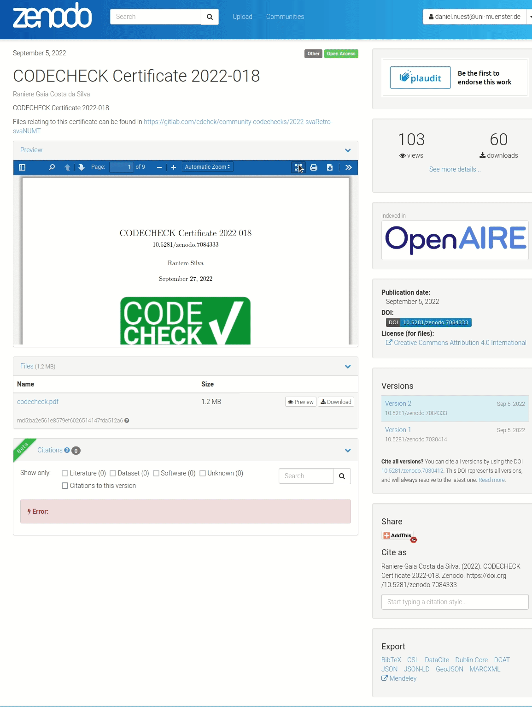
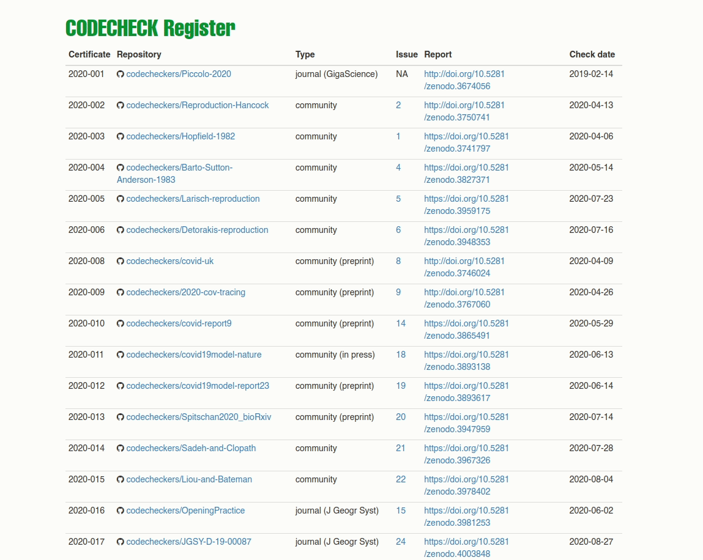

## CODECHECK Co-PIs

.pull-left[
### Stephen J Eglen


Department of Applied Mathematics and Theoretical Physics & Cambridge Computational Biology Institute, University of Cambridge

Fellow of Magdalene College and The Alan Turing Institute

<https://orcid.org/0000-0001-8607-8025>
]

.pull-right[
### Daniel Nüst


Institute for Geoinformatics, University of Münster

Chair of Geoinformatics, TU Dresden

<https://orcid.org/0000-0002-0024-5046>
]

---
class: inverse

.pull-left[

<span style="font-size: 10em;"> 🕵 </span>

<span style="font-size: 10em;"> 🧾 </span>

]

--

.pull-right[


<https://doi.org/10.5281/zenodo.7084333>

]

---
# CODECHECK principles

--

### 1. Codecheckers record but don't investigate or fix.

--

### 2. Communication between humans is key.

--

### 3. Credit is given to codecheckers.

--

### 4. Workflows must be auditable.

--

### 5. Open by default and transitional by disposition.

---
# Variations in a codecheck


<br>

Figure 3 of <https://doi.org/10.12688/f1000research.51738.2>

---
class: inverse



<https://codecheck.org.uk/register/>

---
class: inverse
# CODECHECK paper


<https://doi.org/10.12688/f1000research.51738.2>

---
class: inverse


```{r copy_slides_to_docs, include=FALSE}
file.copy(from = "codecheck-video.html",
          to = file.path("../docs"),
          overwrite = TRUE)
file.copy(from = "libs",
          to = file.path("../docs"),
          overwrite = TRUE, recursive = TRUE)
file.copy(from = "macros.js",
          to = file.path("../docs"),
          overwrite = TRUE)
file.copy(from = "codecheck.css",
          to = file.path("../docs"),
          overwrite = TRUE)
file.copy(from = list.files(getwd(), "*.jpg", full.names = TRUE),
          to = file.path("../docs"),
          overwrite = TRUE)
```

```{r create_pdf, eval=FALSE, include=FALSE}
current_dir <- dirname(rstudioapi::getSourceEditorContext()$path)
setwd(current_dir)
current_file <- basename(rstudioapi::getSourceEditorContext()$path)
system(paste0("cat ", current_file, " | grep -v '^--$' > print.Rmd"))
rmarkdown::render("print.Rmd", "xaringan::moon_reader")
xaringan::decktape(file = "print.html", output = "slides.pdf", docker = TRUE)
file.copy(from = "slides.pdf",
          to = file.path("..", "docs", paste0(tools::file_path_sans_ext(current_file), ".pdf")),
          overwrite = TRUE)
file.remove("slides.pdf", "print.html", "print.Rmd")
```
